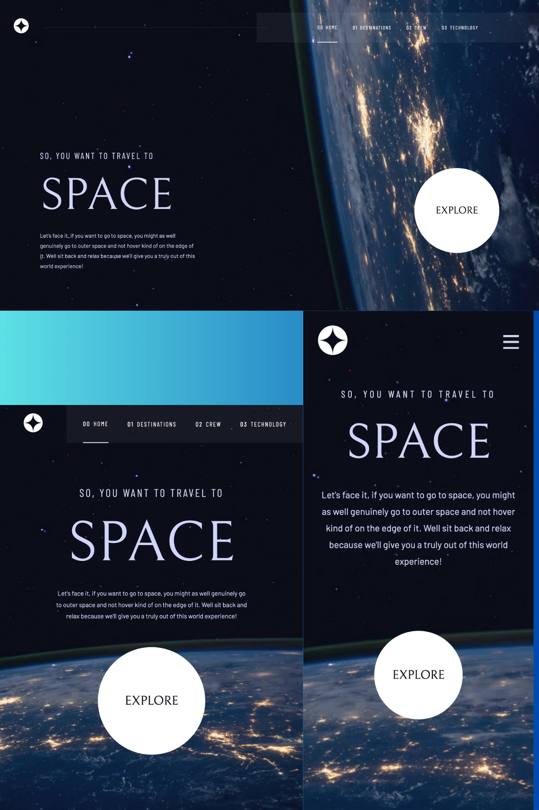

# Frontend Mentor - Space tourism website solution

This is a solution to the [Space tourism website challenge on Frontend Mentor](https://www.frontendmentor.io/challenges/space-tourism-multipage-website-gRWj1URZ3). Frontend Mentor challenges help you improve your coding skills by building realistic projects. 

## Table of contents

- [Overview](#overview)
  - [The challenge](#the-challenge)
  - [Screenshot](#screenshot)
  - [Links](#links)
- [My process](#my-process)
  - [Built with](#built-with)
  - [What I learned](#what-i-learned)
  - [Continued development](#continued-development)
- [Author](#author)

## Overview

### The challenge

Users should be able to:

- View the optimal layout for each of the website's pages depending on their device's screen size
- See hover states for all interactive elements on the page
- View each page and be able to toggle between the tabs to see new information

### Screenshot

### Links

- Solution URL: [https://github.com/915fonzie/space-tourism-website](https://github.com/915fonzie/space-tourism-website)
- Live Site URL: [https://fonzies-space-tourism.netlify.app/](https://fonzies-space-tourism.netlify.app/)

## My process

### Built with

- Semantic HTML5 markup
- CSS custom properties
- SASS
- Flexbox
- CSS Grid
- Mobile-first workflow
- [React](https://reactjs.org/) - JS library
- [React Router](https://reactrouter.com/en/main) - JS library
- [Framer Motion](https://www.framer.com/motion/) - Animation library
- [Styled Components](https://styled-components.com/) - For styles

### What I learned

In this project I learned how to use Framer Motion to animate pages and components.

### Continued development

I only did simple animations for my pages in this project, but I will continue to delve more into framer motion to create more complex animations.
I also want to do more projects with pages to get more familiar with the new version of react router.

## Author

- Website - [Alfonso Pruneda-Suarez](https://www.fonziepruneda.com)
- Frontend Mentor - [@915fonzie](https://www.frontendmentor.io/profile/915fonzie)

**Note: Delete this note and add/remove/edit lines above based on what links you'd like to share.**

